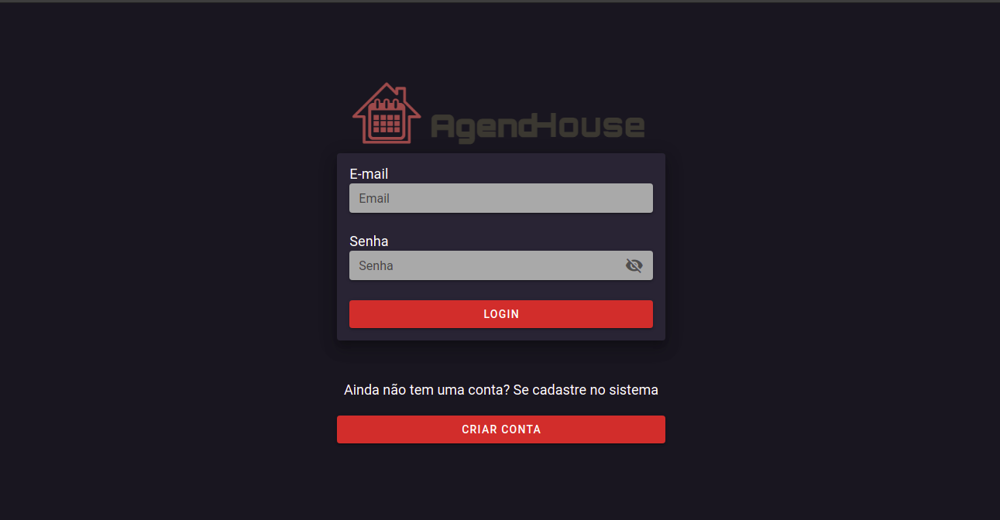
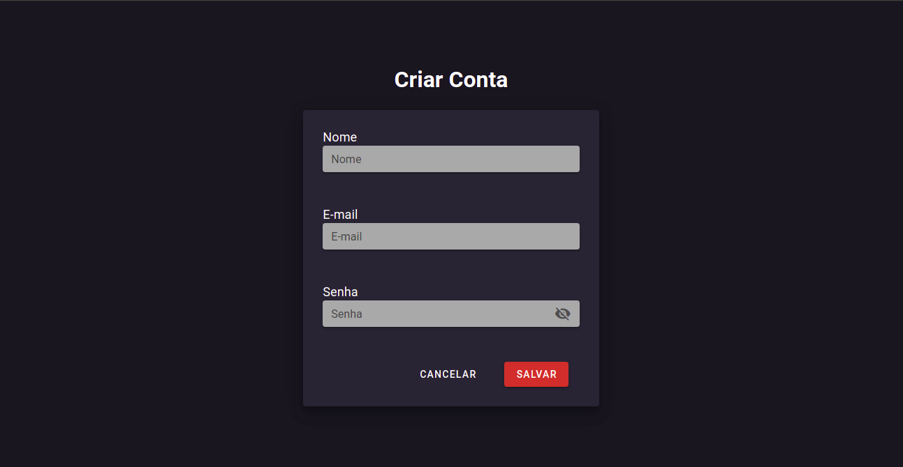
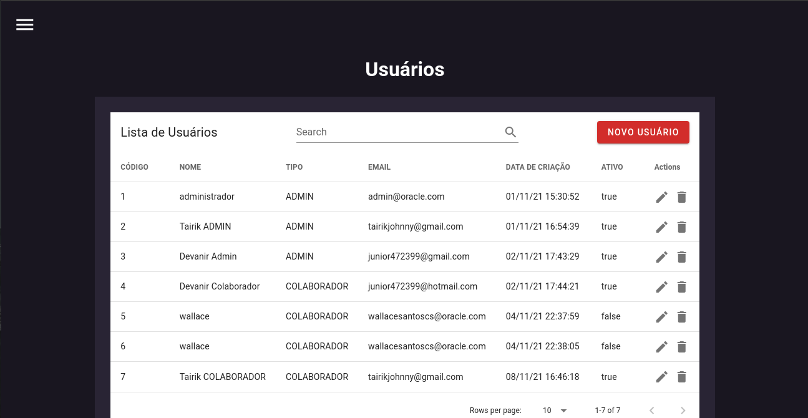
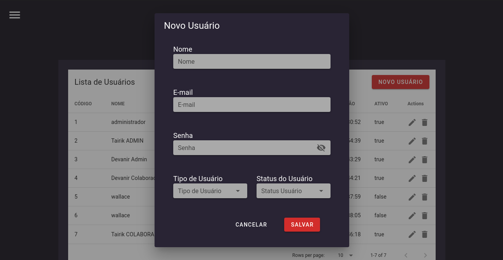
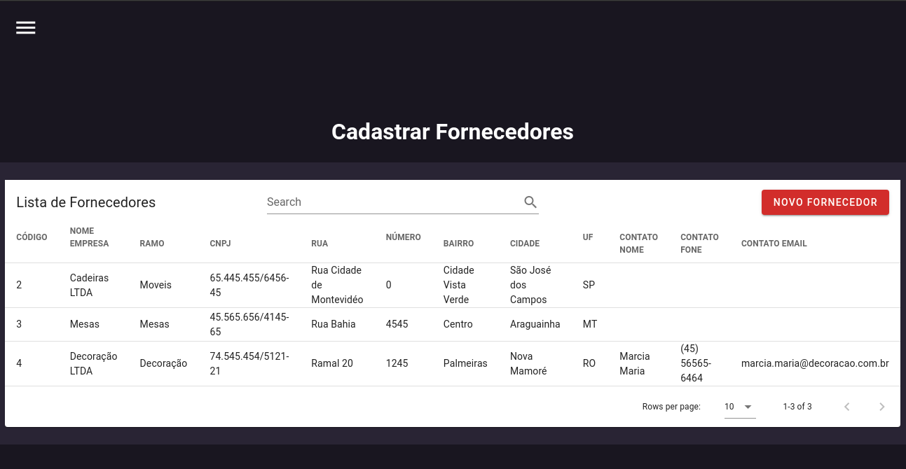
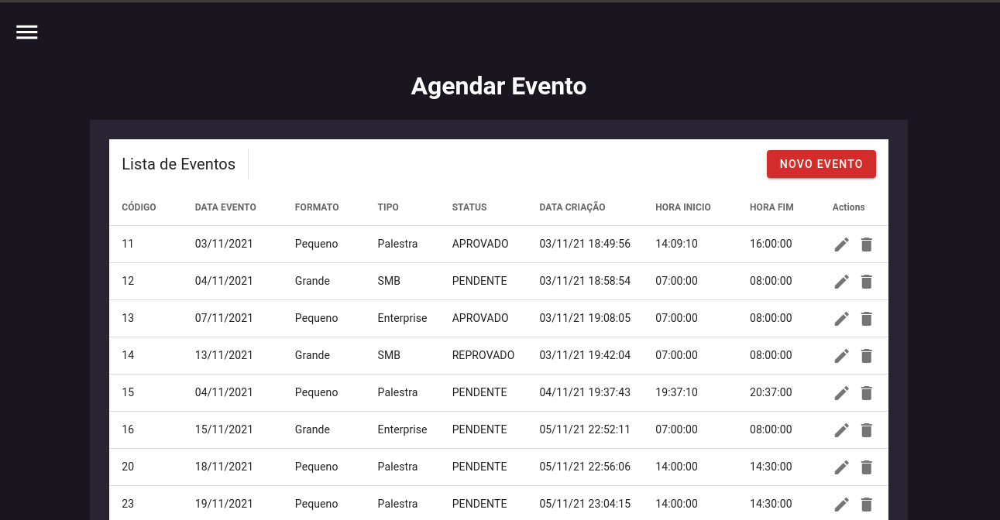
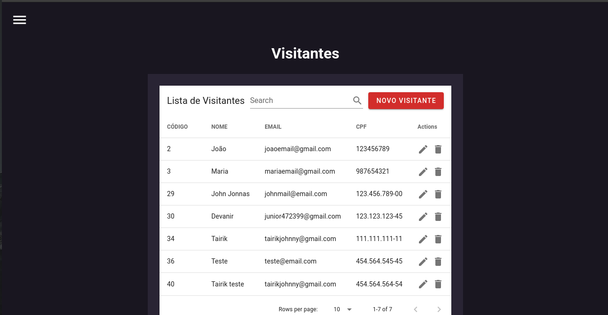
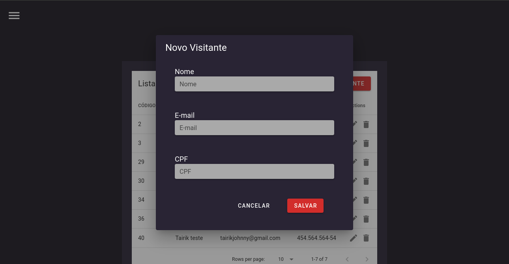

<h4 align="center">Tairik Johnny Maciel Nishimura</h4>

# 
<h1 align="center">Olá, sou Tairik</h1>

Estudante de computação, desenvolvedor e estas são minhas experiências na Fatec SJC.

<h1 align="center">API 4º SEMESTRE</h1>

<h3 align="center">Resumo do Projeto</h3>

<p>  </p>

<h4 align="center">Resumo</h4>

O projeto a ser desenvolvido vai ser um sistema para agendamentos de eventos na [Casa Oracle](https://blogs.oracle.com/oracle-brasil/casa-oracle-abre-as-portas-para-a-inovacao-em-sao-paulo) buscando solucionar os obstáculos da pandemia do [Covid-19](https://covid.saude.gov.br/).

<h4 align="center">Status do projeto</h4>

Sistema 🚀 Finalizado

<h4 align="center">Projeto 🖥</h4>
Projeto realizado em parceria com a Oracle Corporation uma empresa que atua na área da Computação e Informática juntamente com a Faculdade de Tecnologia de São José dos Campos Professor Jessen Vidal.

<h4 align="center">Desafio 📈</h4>
Desafio proposto pela Oracle Corporation - "No escritório de São Paulo, temos um espaço de inovação aberta chamado Casa Oracle, que é um local para realização de eventos internos/externos, workshops e palestras. Dentro do contexto das restrições sanitárias, nosso desafio é criar uma plataforma para o gerenciamento da utilização do espaço, onde nossos colaboradores poderão fazer a solicitação de agendamento, definindo os convidados e recursos necessários para o evento."

<h3 align="center">Tecnologias adotadas na solução</h3>

As seguintes ferramentas foram usadas na construção do projeto:

<a href="https://vuejs.org/">
  
</a>
<a href="https://www.java.com/pt-BR/">
  
</a>
<a href="https://www.oracle.com/br/cloud/">
  
</a>
<a href="https://www.atlassian.com/software/jira">
  
</a>
<a href="https://git-scm.com/">
  
</a>
<a href="https://nodejs.org/en/">
  
</a>
<a href="https://www.npmjs.com/">
  
</a>
<a href="https://maven.apache.org/">
  
</a>
<a href="https://spring.io/projects/spring-boot">
  
</a>

<h3 align="center">Contribuições individuais/pessoais</h3>

 - Nesse projeto do 4º semestre eu assumi o papel de Scrum Master e atuei efetivamente no front-end.
 - Trabalhei principalmente no Front-end desenvolvendo as telas e consumindo as API REST, programei cerca de 80% do front-end.
 - Dei a ideia de ser utilizado o Vuejs como framework web.
 - Ajudei alguns integrantes que não conheciam o framework Vuejs.
 - Fiz todo o gerenciamento do GitHub, como acessos ao repositorio e gerenciamento de branchs.
 - Exercendo o papel de Scrum Master eu ajudei a gerenciar a equipe e o projeto, marcando as reuniões e seguindo os rituais da metodologia SCRUM.
 
<h4 align="center">Telas desenvolvidas por mim</h4>

<p align="center"> Tela de Login </p>
<p align="center">  </p>

```bash
<v-form
  ref="form"
  v-model="valid"
  lazy-validation
  @submit.prevent="do_login"
>
  <span style="color: white; font-size: 18px">E-mail</span>
  <v-text-field
    label="Email"
    v-model="usuario.email"
    :rules="regra_email"
    single-line
    solo
    required
    dense
    background-color="#A9A9A9"
  ></v-text-field>
  <span style="color: white; font-size: 18px">Senha</span>
  <v-text-field
    label="Senha"
    v-model="usuario.senha"
    :rules="regra_senha"
    background-color="#A9A9A9"
    single-line
    solo
    required
    dense
    password
    :append-icon="show1 ? 'mdi-eye' : 'mdi-eye-off'"
    :type="show1 ? 'text' : 'password'"
    @click:append="show1 = !show1"
  ></v-text-field>
  <v-btn
    id="botao-login"
    block
    color="#C84634"
    type="submit"
    class="white--text"
    :disabled="!valid"
    @click="validate"
    >Login</v-btn
  >
</v-form>
```

<p align="center"> Tela para um usuário externo criar uma conta no sistema </p>
<p align="center">  </p>

```bash
<v-form
  ref="form"
  v-model="valid"
  lazy-validation
  @submit.prevent="cadastrar_usuario"
>
  <v-container>
    <v-row justify="center">
      <v-col cols="24">
        <span style="color: white; font-size: 18px">Nome</span>
        <v-text-field
          label="Nome"
          v-model="usuario.nome"
          :rules="regra_nome"
          single-line
          solo
          required
          dense
          background-color="#A9A9A9"
        ></v-text-field>
      </v-col>
    </v-row>
    <v-row justify="center">
      <v-col cols="24">
        <span style="color: white; font-size: 18px"
          >E-mail</span
        >
        <v-text-field
          label="E-mail"
          v-model="usuario.email"
          :rules="regra_email"
          single-line
          solo
          required
          dense
          background-color="#A9A9A9"
        ></v-text-field>
      </v-col>
    </v-row>
    <v-row justify="center">
      <v-col cols="24">
        <span style="color: white; font-size: 18px">Senha</span>
        <v-text-field
          label="Senha"
          v-model="usuario.senha"
          :rules="regra_senha"
          background-color="#A9A9A9"
          single-line
          solo
          required
          dense
          password
          :append-icon="show1 ? 'mdi-eye' : 'mdi-eye-off'"
          :type="show1 ? 'text' : 'password'"
          @click:append="show1 = !show1"
        ></v-text-field>
      </v-col>
    </v-row>
    <v-row>
      <v-col></v-col>
      <v-col>
        <v-btn text color="white" :to="{ name: 'Login' }"
          >Cancelar</v-btn
        >
      </v-col>
      <v-col>
        <v-btn
          color="#C84634"
          class="white--text mr-4"
          type="submit"
          :disabled="!valid"
          @click="validate"
        >
          Salvar
        </v-btn>
      </v-col>
    </v-row>
  </v-container>
</v-form>
```

<p align="center"> Tela de gerenciamento de Usuário (CRUD)</p>
<p align="center">  </p>
<p align="center">  </p>

```bash
// Método de cadastro de usuario
cadastrar_usuario() {
  // Se o usuario não tiver um "cod" significa que esse usuario não existe então ele vai pra resquest de cadastro
  if (!this.usuario.cod) {
    Usuario.salvar_usuario(this.usuario)
      .then((resposta_cadastro_usuario) => {
        this.usuario = {};
        Swal.fire(
          "Sucesso",
          "Usuário " +
            resposta_cadastro_usuario.data.nome +
            " cadastrado com sucesso!!!",
          "success"
        );
        this.exibir_usuario();
      })
      .catch((e) => {
        Swal.fire(
          "Oops...",
          "Erro ao cadastrar o usuário! - Erro: " + e.response.data.error,
          "error"
        );
      });
    this.close();
  } else {
    // Método de atualizar usuario
    // Se o usuario já tiver um "cod" ele já existe então ele vai pra request de atualizar
    Usuario.atualizar_usuario(this.usuario)
      .then((resposta_atualizar_usuario) => {
        this.usuario = {};
        Swal.fire(
          "Sucesso",
          "Usuário " +
            resposta_atualizar_usuario.data.nome +
            " atualizado com sucesso!!!",
          "success"
        );
        this.exibir_usuario();
      })
      .catch((e) => {
        Swal.fire(
          "Oops...",
          "Erro ao atualizar o usuário! - Erro: " + e.response.data.error,
          "error"
        );
      });
    this.close();
  }
},
```

<p align="center"> Tela de Fornecedor</p>
<p align="center">  </p>

<p align="center"> Tela de Agendamento de Evento</p>
<p align="center">  </p>

```bash
// Método pra exibir os eventos
exibir_evento() {
  Evento.listar_eventos()
    .then((resposta_lista_evento) => {
      this.lista_de_eventos = resposta_lista_evento.data;
    })
    .catch((e) => {
      Swal.fire(
        "Oops...",
        "Erro ao carregar a tabela de eventos! - Erro: " +
          e.response.data.error,
        "error"
      );
    });
},
```

<p align="center"> Tela de Visitante (CRUD)</p>
<p align="center">  </p>
<p align="center">  </p>

```bash
// Método pra excluir os visitantes
deletar_visitante(visitante) {
  Visitante.excluir_visitante(visitante)
    .then((resposta_excluir_visitante) => {
      Swal.fire("Sucesso", "Visitante excluido com sucesso!!!", "success");
      resposta_excluir_visitante;
      this.exibir_visitante();
    })
    .catch((e) => {
      Swal.fire(
        "Oops...",
        "Erro ao excluir o visitante! - Erro: " + e.response.data.error,
        "error"
      );
    });
  this.closeDelete();
},
```

<h4 align="center">Hard Skills Efetivamente Desenvolvidas</h4>

- [X] Aprofundei meus conhecimentos no framework Vuejs como um todo.
- [X] Aprendi a trabalhar com API REST no Vuejs.
- [X] Aprendi a trabalhar com gerencimento de Organizações e Repositórios no GitHub.
- [X] Aprendi como é gerenciar uma equipe através do método SCRUM.
- [X] Aprofundei os meus conhecimentos na padrão de projetos MVC, o seu princípio básico é a divisão da aplicação em três camadas: a camada de interação do usuário (view), a camada de manipulação dos dados (model) e a camada de controle (controller).
- [X] Como utilizamos um framework Javascript para facilitar a programação eu aprofundei os meus conhecimentos no padrão de projetos Facade que é um padrão de projeto estrutural que fornece uma interface simplificada para uma biblioteca, um framework, ou qualquer conjunto complexo de classes.
- [X] Como utlizamos o framework Javascript Vuejs aonde temos a estrutura de componentes compondo componentes eu aprofundei os meus conhecimentos no padrão de projetos Composite que é um padrão de projeto estrutural que permite que você componha objetos em estruturas de árvores e então trabalhe com essas estruturas como se elas fossem objetos individuais.

<h4 align="center">Soft Skills Efetivamente Desenvolvidas</h4>

- [X] Trabalho em equipe
- [X] Responsabilidade
- [X] Organização
- [X] Gestão do tempo
- [X] Confiança